# Wizualna Dokumentacja Systemu - EVA Website

**Data utworzenia:** 2025-01-27  
**Wersja:** 0.1-alpha

## Spis Treści

1. [Architektura Systemu](#1-architektura-systemu)
2. [Przepływ Danych - Konfigurator](#2-przepływ-danych---konfigurator)
3. [Przepływ Danych - Koszyk](#3-przepływ-danych---koszyk)
4. [Przepływ Danych - Checkout](#4-przepływ-danych---checkout)
5. [Odpowiedzialności Komponentów](#5-odpowiedzialności-komponentów)
6. [Integracje Zewnętrzne](#6-integracje-zewnętrzne)

---

## 1. Architektura Systemu

### 1.1 Warstwy Architektury

```mermaid
graph TB
    subgraph "Frontend Layer"
        A[Next.js App Router]
        B[React Components]
        C[Custom Hooks]
        D[UI Components]
    end
    
    subgraph "Business Logic Layer"
        E[Services]
        F[CartService]
        G[OrderService]
        H[MatService]
        I[PricingService]
    end
    
    subgraph "Data Access Layer"
        J[Repositories]
        K[OrderRepository]
        L[MatRepository]
        M[AccessoryRepository]
    end
    
    subgraph "API Layer"
        N[API Routes]
        O[/api/orders]
        P[/api/mats]
        Q[/api/cart]
    end
    
    subgraph "Database"
        R[(Supabase PostgreSQL)]
    end
    
    subgraph "External Services"
        S[Bitrix24]
        T[Przelewy24]
        U[CarMat API]
    end
    
    A --> B
    B --> C
    C --> E
    E --> J
    J --> R
    B --> N
    N --> E
    E --> S
    E --> T
    E --> U
```

### 1.2 Struktura Folderów i Odpowiedzialności

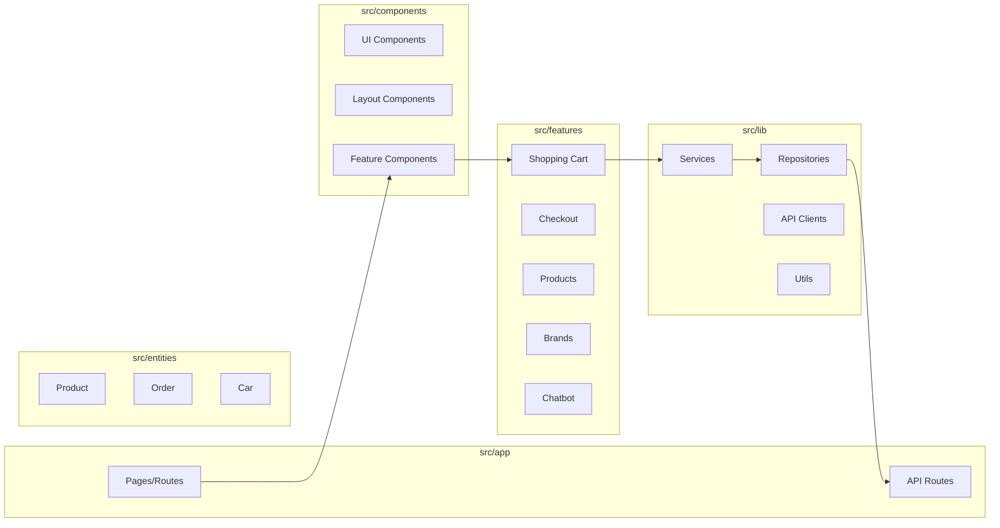

---

## 2. Przepływ Danych - Konfigurator

### 2.1 Proces Konfiguracji Produktu

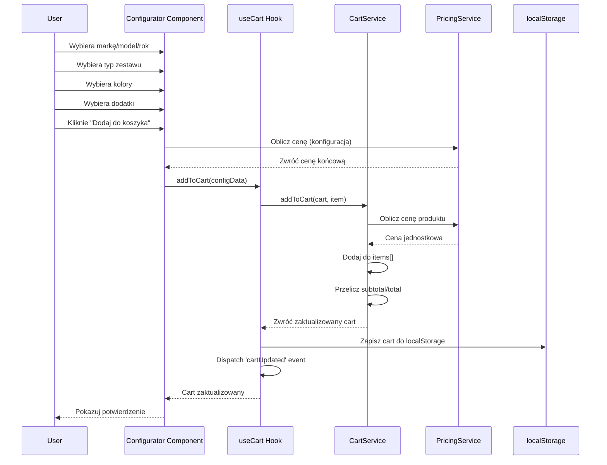

### 2.2 Struktura Danych Konfiguracji

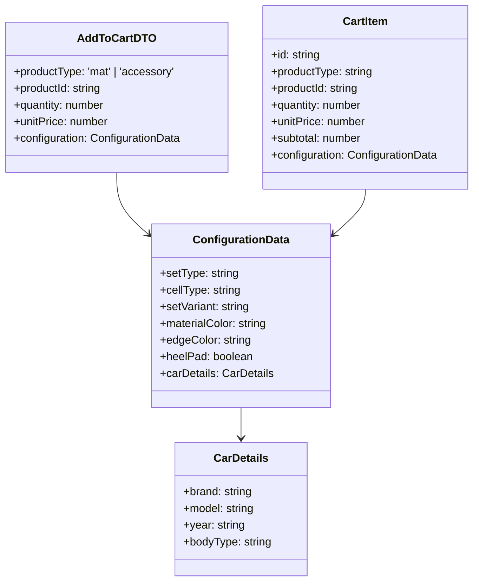

---

## 3. Przepływ Danych - Koszyk

### 3.1 Zarządzanie Koszykiem

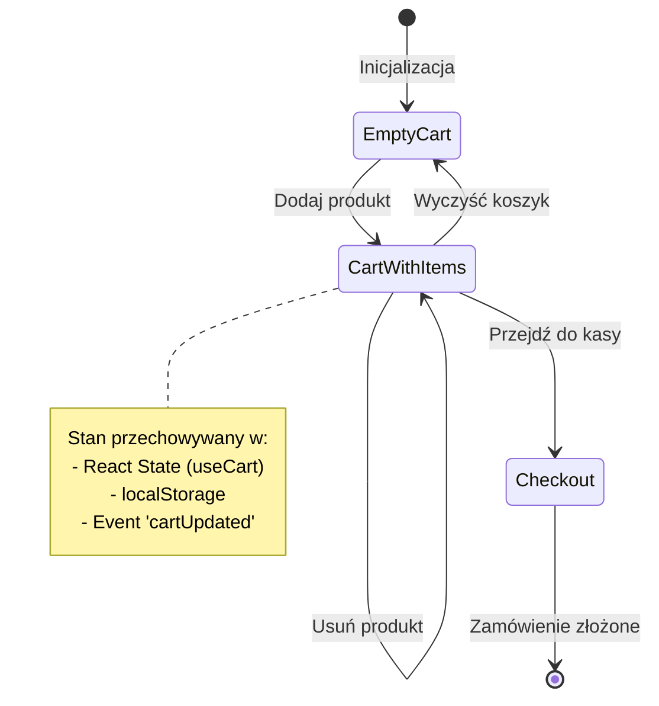

### 3.2 Synchronizacja Koszyka

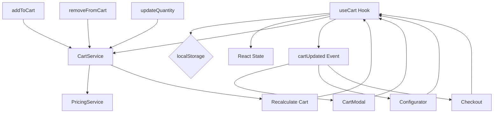

---

## 4. Przepływ Danych - Checkout

### 4.1 Proces Składania Zamówienia

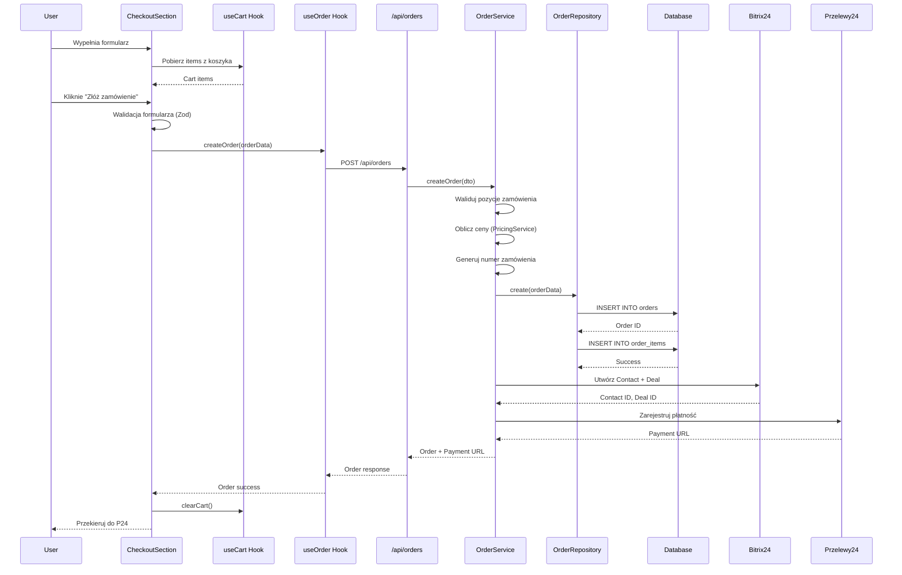

### 4.2 Struktura Zamówienia

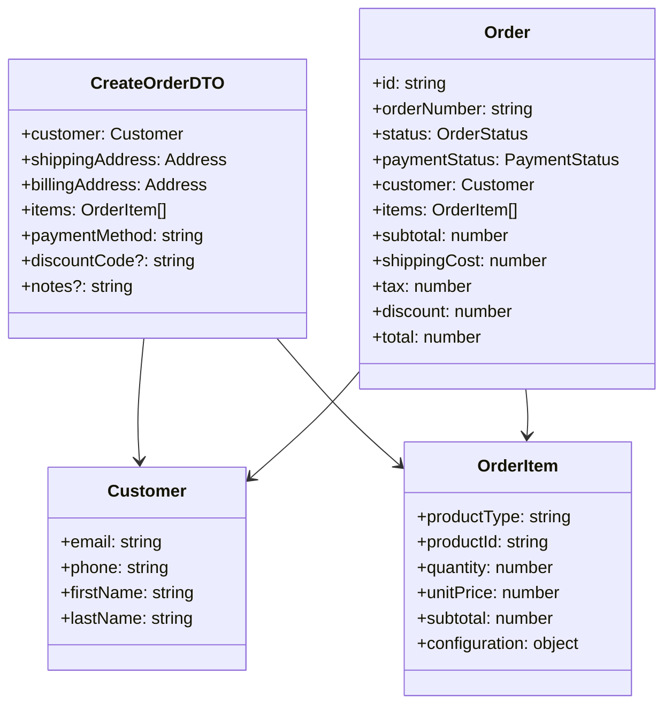

---

## 5. Odpowiedzialności Komponentów

### 5.1 Hierarchia Komponentów Frontend

```mermaid
graph TD
    A[RootLayout] --> B[Navbar]
    A --> C[Page Content]
    A --> D[Footer]
    A --> E[Chatbot]
    A --> F[SessionProvider]
    A --> G[TrackingProvider]
    A --> H[QueryProvider]
    
    C --> I[Home Page]
    C --> J[CarModelsSection]
    C --> K[Configurator]
    C --> L[CheckoutSection]
    
    I --> M[HeroSection]
    I --> N[ProductGallerySection]
    I --> O[AdvantagesSection]
    
    J --> P[BrandGridCard]
    J --> Q[ModelNavigationBar]
    J --> R[useCarModelsFilters]
    
    K --> S[ConfiguratorSimple]
    K --> T[useCart Hook]
    
    L --> U[CheckoutForm]
    L --> V[useOrder Hook]
    L --> T
    
    style A fill:#1a1a1a,stroke:#ff0000,stroke-width:3px
    style T fill:#0066cc,stroke:#003366,stroke-width:2px
    style V fill:#0066cc,stroke:#003366,stroke-width:2px
```

### 5.2 Odpowiedzialności Główne

| Komponent | Odpowiedzialność | Zależności |
|-----------|-----------------|------------|
| **Configurator** | Zbieranie konfiguracji produktu, walidacja kroków | useCart, PricingService |
| **CartModal** | Wyświetlanie koszyka, zarządzanie pozycjami | useCart, CartItem |
| **CheckoutSection** | Formularz zamówienia, walidacja, płatność | useCart, useOrder, PricingService |
| **CarModelsSection** | Wybór marki/modelu, filtrowanie | useCarModels, useCarModelsFilters |
| **useCart** | Stan koszyka, operacje CRUD | CartService, localStorage |
| **useOrder** | Tworzenie zamówień | OrderService, API client |
| **CartService** | Logika biznesowa koszyka | MatService, AccessoryService, PricingService |
| **OrderService** | Logika biznesowa zamówień | OrderRepository, Bitrix24, Przelewy24 |

---

## 6. Integracje Zewnętrzne

### 6.1 Przepływ Integracji z Bitrix24

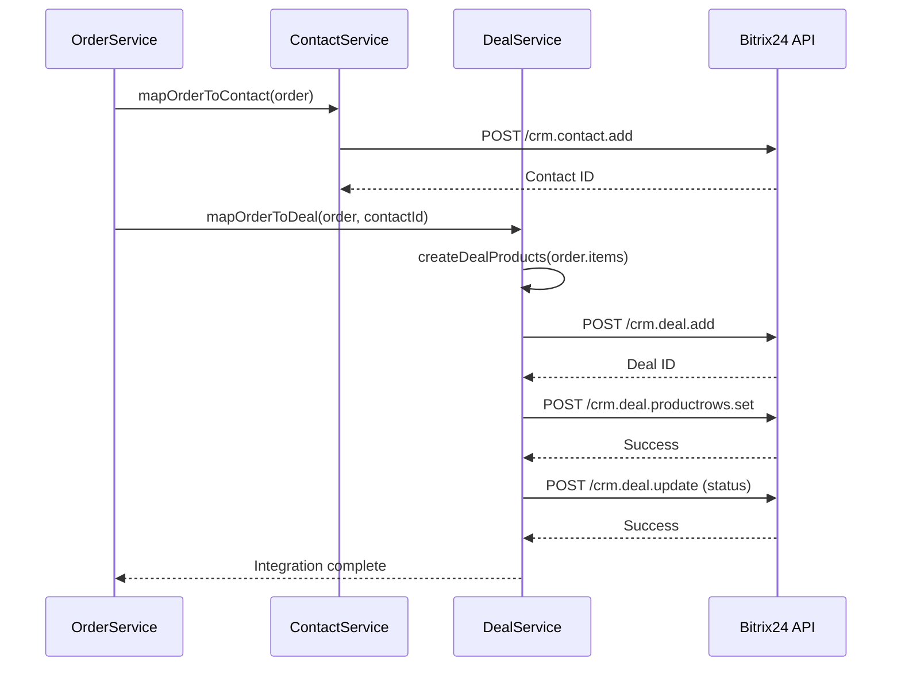

### 6.2 Przepływ Płatności Przelewy24

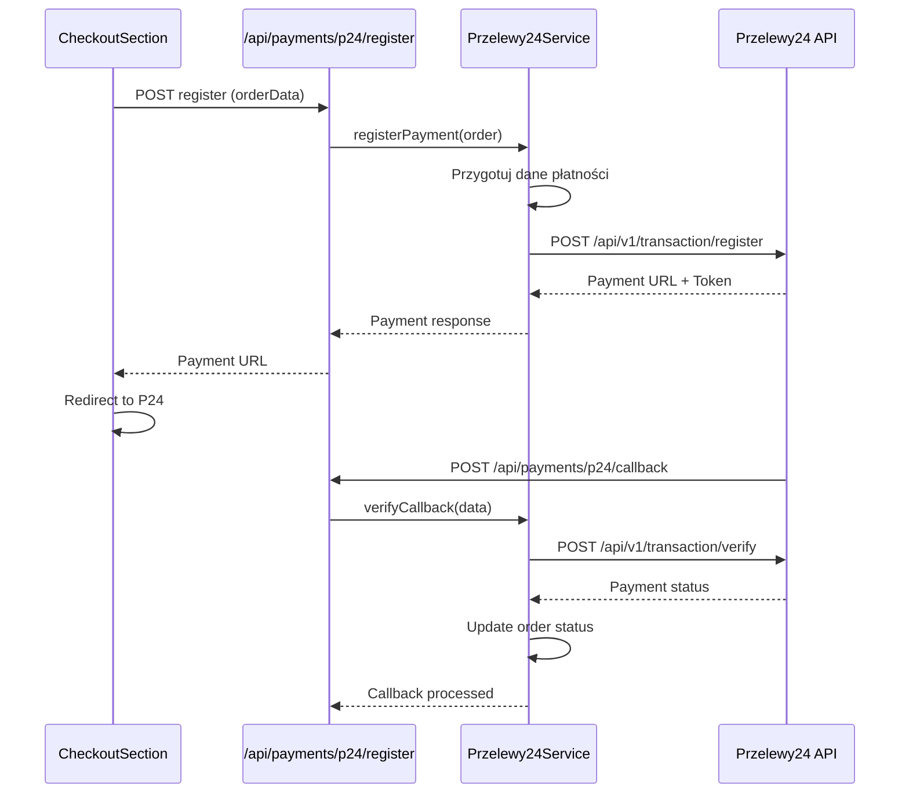

---

## 7. Przepływ Danych - End-to-End

### 7.1 Pełny Przepływ od Konfiguracji do Płatności

```mermaid
graph TB
    Start([Użytkownik wchodzi na stronę]) --> Config[Konfigurator]
    Config --> SelectCar[Wybór samochodu]
    SelectCar --> SelectType[Wybór typu zestawu]
    SelectType --> SelectColors[Wybór kolorów]
    SelectColors --> AddToCart[Dodaj do koszyka]
    
    AddToCart --> CartService[CartService.addToCart]
    CartService --> Pricing[PricingService.calculate]
    Pricing --> SaveCart[Zapisz do localStorage]
    SaveCart --> CartModal[Pokaż CartModal]
    
    CartModal --> CheckoutBtn[Przejdź do kasy]
    CheckoutBtn --> Checkout[CheckoutSection]
    
    Checkout --> FillForm[Wypełnij formularz]
    FillForm --> Validate[Walidacja Zod]
    Validate --> SubmitOrder[Złóż zamówienie]
    
    SubmitOrder --> OrderService[OrderService.createOrder]
    OrderService --> ValidateItems[Walidacja pozycji]
    ValidateItems --> CalculatePrice[Oblicz ceny]
    CalculatePrice --> GenerateNumber[Generuj numer]
    GenerateNumber --> SaveDB[Zapisz do DB]
    
    SaveDB --> Bitrix24[Integracja Bitrix24]
    Bitrix24 --> Przelewy24[Rejestracja P24]
    Przelewy24 --> Redirect[Przekieruj do płatności]
    
    Redirect --> Payment[Płatność P24]
    Payment --> Callback[Callback P24]
    Callback --> UpdateOrder[Aktualizuj status]
    UpdateOrder --> Success([Zamówienie złożone])
    
    style Start fill:#90EE90
    style Success fill:#90EE90
    style CartService fill:#FFD700
    style OrderService fill:#FFD700
    style Bitrix24 fill:#87CEEB
    style Przelewy24 fill:#87CEEB
```

---

## 8. Mapowanie Odpowiedzialności

### 8.1 Warstwa Prezentacji (Components)

| Komponent | Odpowiedzialność | Nie robi |
|-----------|-----------------|----------|
| **Configurator** | UI konfiguracji, walidacja kroków | Obliczanie cen, zapis do DB |
| **CartModal** | Wyświetlanie koszyka, UI operacji | Logika biznesowa koszyka |
| **CheckoutSection** | Formularz zamówienia, walidacja | Tworzenie zamówień w DB |
| **CarModelsSection** | Lista modeli, filtrowanie | Pobieranie danych z API |

### 8.2 Warstwa Logiki Biznesowej (Services)

| Serwis | Odpowiedzialność | Zależności |
|--------|-----------------|------------|
| **CartService** | Operacje na koszyku, walidacja | MatService, AccessoryService, PricingService |
| **OrderService** | Tworzenie zamówień, integracje | OrderRepository, Bitrix24, Przelewy24 |
| **MatService** | Zarządzanie dywanikami | MatRepository |
| **PricingService** | Kalkulacje cenowe | - |
| **ConfiguratorService** | Walidacja konfiguracji | ProductFactory |

### 8.3 Warstwa Dostępu do Danych (Repositories)

| Repozytorium | Odpowiedzialność | Tabele |
|--------------|-----------------|--------|
| **OrderRepository** | CRUD zamówień | orders, order_items |
| **MatRepository** | CRUD dywaników | mats, car_models |
| **AccessoryRepository** | CRUD akcesoriów | accessories |

---

## 9. Diagram Stanów

### 9.1 Stan Koszyka

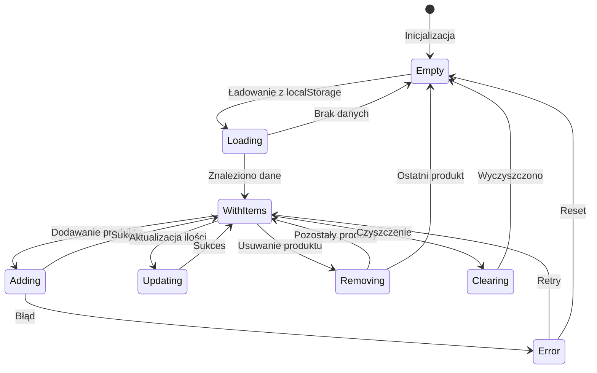

### 9.2 Stan Zamówienia

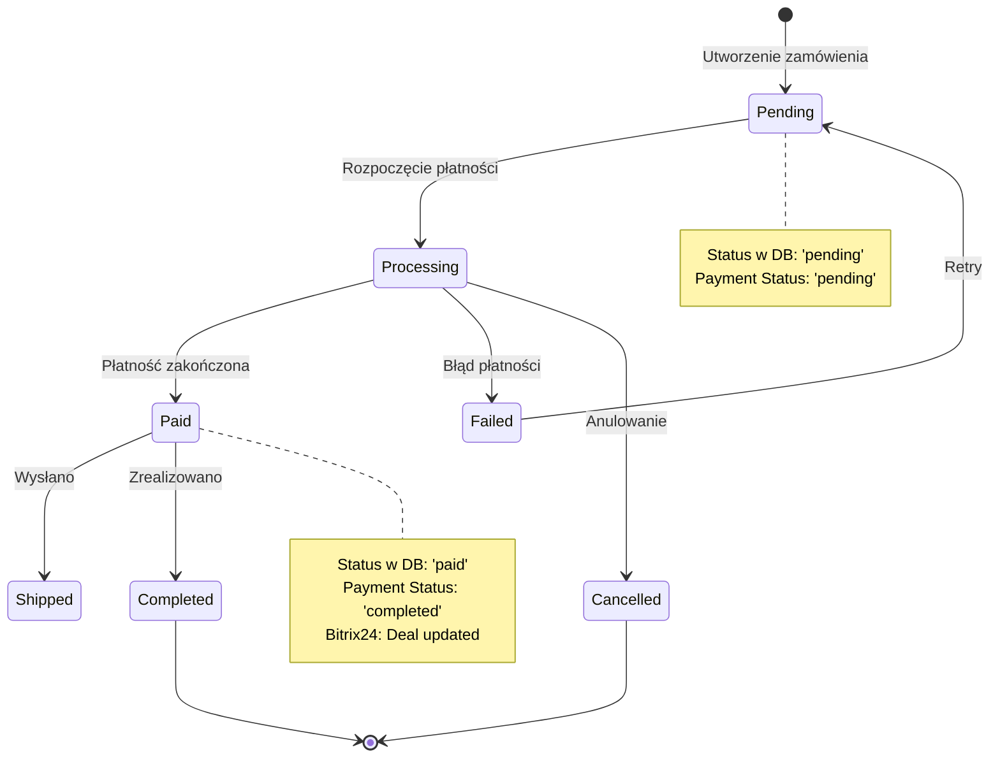

---

## 10. Podsumowanie Architektury

### 10.1 Zasady Projektowe

1. **Separation of Concerns**
   - Komponenty = UI tylko
   - Hooks = Stan i logika UI
   - Services = Logika biznesowa
   - Repositories = Dostęp do danych

2. **Single Responsibility**
   - Każdy serwis ma jedną odpowiedzialność
   - Komponenty są małe i skupione

3. **Dependency Injection**
   - Services używają Repositories przez konstruktor
   - Hooks używają Services przez instancje

4. **Data Flow**
   - Jednokierunkowy przepływ danych
   - State management przez React hooks
   - Synchronizacja przez events

### 10.2 Kluczowe Decyzje Architektoniczne

- ✅ **Client-side cart** - localStorage dla szybkości
- ✅ **Server-side orders** - bezpieczeństwo i integracje
- ✅ **Hybrid session** - client + server session ID
- ✅ **Event-based sync** - cartUpdated event dla synchronizacji
- ✅ **Service layer** - enkapsulacja logiki biznesowej
- ✅ **Repository pattern** - abstrakcja dostępu do danych

---

**Koniec dokumentacji**

